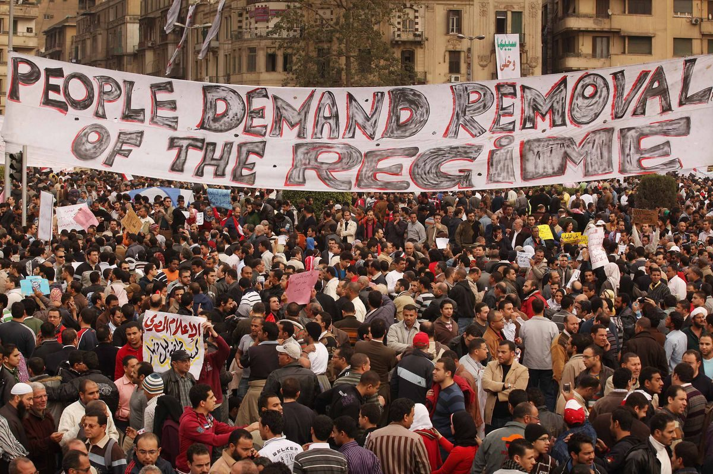

---
title: Protest and Social Movements
subtitle: 'Summer 2023, Summer 2024'
summary: In this course, students explore the dynamics, strategies, and impacts of protests and social movements across different regions and historical contexts. By examining case studies and theoretical frameworks, students gain insight into the role of social mobilization in effecting political change and shaping collective identities.

    

    
# Date updated
lastmod: '2024-04-13'

authors:
  - admin

tags:
  - Academic Course

---